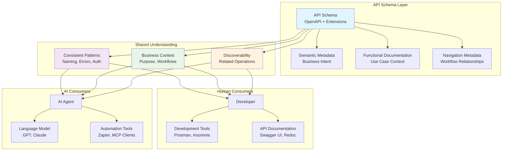

# Designing APIs for AI Agents: Building Better Interfaces for Machine Use

The API development world changed a lot in 2024, and it caught many of us by surprise. While we were busy making APIs better for human developers, a new consumer appeared that works very fast: AI agents. Postman's latest State of the API report shows clearly that 89% of developers now use AI tools every day, but only 24% design APIs with AI agents in mind. This gap shows a big problem that needs new design patterns.

## The Big Challenge: Designing for AI consumption

When I design APIs today, I still think about the developer who will read my docs, understand my endpoint patterns, and write code to connect with it. But here's what Postman's research showed that really changed how I think about building APIs: AI agents are already using APIs at huge scale with a 40% increase from last year.

The disconnect is there. While 89% of developers use AI tools for making code and solving problems, most of us keep designing APIs using patterns made for human use. Only 13% design equally for humans and AI agents, while just 7% mainly design for AI agents. This mismatch creates basic problems when AI agents meet APIs that don't have clear schemas, typed errors, and clear behavioral rules.

## Design Patterns for Human and Machine Use

The key thing I've learned is that AI agents are trained on human language, which means we shouldn't design only for machines. Instead, we need to design for both humans and machines at the same time through consistent, well-documented interfaces that show intent and purpose.

### Schema as the Shared Language

I think of the API schema as the shared language between humans and machines. The schema is not just a technical contract—it's a complete way to communicate that shows intent, purpose, and business context in ways both developers and AI agents can understand.

**Semantic Metadata: Intent and Purpose**

The schema should tell a story about what the API does and why it exists. This means using clear field names that show business concepts, useful error codes that help fix problems, and response structures that show how things work together. When an AI agent sees a well-designed schema, it understands not just what data to send, but why that data matters and how it connects to real business work.

**Functional Documentation: Business Context**

Traditional OpenAPI specs focus on technical contracts, but AI agents need business context to make smart decisions. I learned this the hard way when building APIs that agents couldn't use effectively. Now I put functional context directly into schema definitions through custom properties that give semantic meaning, links that connect technical operations to business outcomes, and workflow descriptions that show how endpoints work together to solve real problems.

This approach changes the schema from a purely technical thing into a complete communication tool. Instead of keeping separate technical and functional documentation, the schema becomes one source of truth that shows both implementation details and business intent.

**Navigation Metadata: Easy Discovery**

The schema should help find related functionality through structured navigation data. This includes relationship patterns that mirror real-world workflows, endpoint hierarchies organized around functional use cases rather than technical resource structures, and built-in guidance that helps both humans and AI agents understand when and how to use specific operations.

In my experience, organizing APIs around the problems they solve, rather than just data model relationships, makes them much easier for human developers while giving AI agents clear functional context about usage patterns.

**Example: Traditional vs. Agent-Aware Schema Design**

Here's how the same endpoint looks when designed traditionally versus with AI agents in mind:

```yaml
# Traditional approach - technical focus
/api/users/{id}:
  get:
    responses:
      200:
        content:
          application/json:
            schema:
              properties:
                id: { type: string }
                name: { type: string }
                email: { type: string }

# Agent-aware approach - semantic focus
/api/users/{userId}:
  get:
    summary: "Retrieve user profile for account management"
    x-business-context:
      purpose: "Account management and user support"
      workflows: ["user-lookup", "billing-inquiry"]
    parameters:
      - name: userId
        schema:
          type: string
          pattern: "^usr_[a-zA-Z0-9]{16}$"
        x-semantic-meaning: "Primary user identifier"
    responses:
      200:
        content:
          application/json:
            schema:
              properties:
                userId: { type: string }
                profile:
                  type: object
                  x-business-purpose: "Identity verification"
                accountStatus:
                  type: string
                  enum: ["active", "suspended", "pending"]
                  x-business-impact: "Determines available actions"
      404:
        description: "User not found"
        x-remediation: "Verify user ID format"
```

### Consistency as a Design Language

Consistency becomes the design language that both humans and machines can learn and use. This means using the same naming rules across all endpoints, standard HTTP status code usage, the same authentication methods, and error handling patterns that create a predictable interaction model.

I use a pattern where every endpoint follows the same basic template: consistent parameter naming that shows business concepts, standard response envelopes that tell a complete story, the same error response formats that give useful guidance, and predictable resource relationship patterns that mirror real-world workflows. This consistency allows both human developers and AI agents to learn patterns once and apply them across the entire API surface.

**Unified Communication Architecture**

The diagram below shows how schema-driven design creates a unified communication layer that serves both human developers and AI agents:



## Security Architecture for AI Consumers

The security implications of AI agents as API consumers present a big challenge, but one that can be addressed with thoughtful design patterns. Postman's research shows that 51% of developers now cite unauthorized agent access as their top security concern, highlighting the need for better security approaches.

Traditional API security designs assumed predictable human behavior, developers making dozens of calls per day, following documented patterns, operating within reasonable rate limits. AI agents challenge these assumptions by operating at high speeds, keeping persistent automated access, and potentially turning a single compromised API key into a gateway for extensive data extraction. However, these challenges create opportunities to build stronger security designs.

### Behavioral Security Architecture

The unpredictable behavior of AI agents makes it hard to tell legitimate automation from attacks using traditional rule-based approaches. While I haven't needed to implement these patterns at scale yet, my team is exploring security designs that move beyond static rules to behavioral analysis systems that can recognize patterns in real-time and adjust responses dynamically.

This approach needs dynamic rate limiting based on behavioral patterns, better monitoring for suspicious activity, and shorter-lived credentials with automatic rotation. The key is building systems that can tell the difference between legitimate automation and potential attacks through behavior rather than static rules.

## The Model Context Protocol: New Standards Coming

The emergence of the Model Context Protocol represents an interesting development in API architecture for AI use. While 70% of developers know about MCP according to Postman's research, only 10% use it regularly. This points to growing interest but limited readiness in the ecosystem.

MCP introduces new patterns for structured interfaces between AI models and real-world systems. It addresses critical problems like unified agent access, standard security models, and structured tool definitions that agents can reliably understand. The protocol defines clear boundaries between what AI agents can discover, understand, and invoke.

### Key Principles from MCP

Regardless of whether MCP becomes the standard, the principles it embodies represent the direction we need to move. Structured interfaces with explicit capability declarations, clear tool definitions with typed parameters and responses, standard security models that work across different agent implementations, and discovery mechanisms that allow agents to understand available functionality.

In my projects, implementing these principles improves API architecture even without full MCP adoption. Making APIs agent-consumable through structured interfaces provides immediate benefits and future flexibility, whether MCP succeeds or alternative standards emerge.

**Example: Semantic Extensions in Practice**

Here's how I extend OpenAPI schemas with semantic metadata in my projects:

```json
{
  "paths": {
    "/customers/{customerId}/support-tickets": {
      "post": {
        "summary": "Create customer support ticket",
        "x-business-context": {
          "purpose": "Enable customers to report issues",
          "workflow-stage": "issue-reporting",
          "related-operations": [
            {
              "operation": "GET /customers/{customerId}/support-tickets",
              "relationship": "list-related"
            }
          ]
        },
        "requestBody": {
          "content": {
            "application/json": {
              "schema": {
                "properties": {
                  "subject": {
                    "type": "string",
                    "x-semantic-purpose": "Primary classification for routing"
                  },
                  "priority": {
                    "type": "string",
                    "enum": ["low", "medium", "high", "critical"],
                    "x-business-rules": {
                      "critical": "Service outage affecting multiple customers",
                      "high": "Feature broken for paying customer"
                    }
                  }
                }
              }
            }
          }
        },
        "responses": {
          "201": {
            "x-business-outcome": "Customer issue is now tracked",
            "content": {
              "application/json": {
                "schema": {
                  "properties": {
                    "ticketId": {
                      "type": "string",
                      "x-semantic-purpose": "Primary reference for follow-up"
                    }
                  }
                }
              }
            }
          }
        }
      }
    }
  }
}
```

This shows how semantic extensions (`x-business-context`, `x-semantic-purpose`) provide context for both developers and AI agents.

### Preparing for Protocol Evolution

The low adoption rate suggests practical barriers that the industry needs to address, but the design patterns remain valuable. Building APIs with explicit capability declarations, structured tool definitions, and clear security boundaries positions systems to adapt to whatever standards emerge.

This approach means designing APIs as tool catalogs rather than simple data interfaces. Each endpoint becomes a tool with clear inputs, outputs, and behavioral contracts that both human developers and AI agents can understand and invoke reliably.

## Key Design Priorities for the Future

Based on what I've seen in recent projects and the trends Postman identified, there are big changes coming in API architecture. The shift from human-focused to machine-focused design needs new patterns, different security models, and better documentation strategies. Four design priorities emerge as critical for systems that need to support both human developers and AI agents well.

### Machine-First Interface Design

APIs must be built with AI agents as primary users rather than afterthoughts. This means designing interfaces that provide machine readable schemas, predictable patterns, and comprehensive behavioral specifications from the ground up. The architecture should assume automated use and optimize for reliability at high speeds.

### Adaptive Security Architecture

Security models must evolve beyond traditional patterns to handle high-speed exploitation, persistent automated attacks, and unpredictable behavior. This needs architectural approaches that can tell the difference between legitimate automation and attacks through behavioral analysis rather than static rules.

### Tool-Oriented Design Patterns

API architecture must shift from simple data interfaces to structured tool catalogs where each endpoint represents a well-defined capability with clear inputs, outputs, and behavioral contracts. This design pattern enables both human developers and AI agents to understand and invoke functionality reliably.

## Conclusion

The API landscape stands at a turning point where we must design for both human understanding and machine use at the same time. The key insight is that AI agents are trained on human language patterns, which creates an opportunity to build unified architectures that serve both audiences well.

My experience shows that the practices needed for effective human-machine API use—consistent patterns, schema-driven functional documentation, and discoverable use case context—create better APIs overall. These aren't competing design goals but approaches that work together and strengthen each other.

The future belongs to APIs that work as complete communication systems, where schemas serve as natural language interfaces and functional documentation is discoverable through the same mechanisms that AI agents use for technical discovery. The design patterns we implement today will determine whether our systems can communicate effectively with both human developers and AI agents.

The time to start building these unified communication architectures is now.