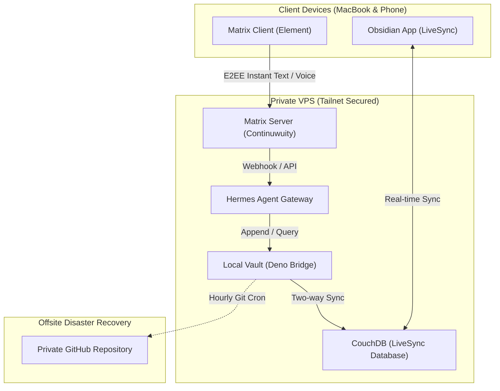

# Mental Cache Invalidation: Self-Hosting a Personal AI Assistant on a $5 VPS to Save Your Weekends

The promise of AI-assisted engineering was supposed to be breathing room. In reality, it turned me into a high-bandwidth orchestrator.

When generating implementations, reviewing distributed systems architectures, and debugging complex traces take minutes instead of hours, you don't touch one problem at a time—you touch ten. By 6 PM, my working memory felt like a distributed system under partition: dozens of dangling references to half-reviewed PRs, edge cases in microservices, and architectural refactors still spinning in my head.

Humans don't have atomic garbage collection. Without a reliable, zero-friction offload mechanism, those open threads followed me into dinner, conversations with family, and sleep. I found myself running an involuntary background process all evening, chewing mental cycles on tomorrow's problems.

I needed a mental cache invalidation mechanism: a private, always-available sink where I could dump raw thoughts from anywhere, trust that they were captured and categorized, and immediately flush my working memory.

Here is how I built that system on a $5 VPS using an owner-operated stack.

## The Architectural Requirements: Zero Friction and Absolute Privacy

Commercial SaaS assistants (ChatGPT, Claude, Notion AI) are impressive, but they failed my personal requirements for two reasons:

1. **Friction kills capture**: If offloading a late-night thought requires unlocking a phone, opening a heavy app, waiting for a web view to load, and navigating menus, I won't do it. Capture must be as low-latency as sending a message to a friend.
2. **Data sovereignty**: I frequently think through proprietary architecture trade-offs, internal client constraints, and unvarnished personal thoughts. Routing those unfiltered into a multi-tenant corporate cloud felt fundamentally irresponsible.

The design constraints became clear: an owner-operated stack running on a modest 2 vCPU, 4 GB RAM Ubuntu server, secured entirely behind a private mesh network, with end-to-end encrypted chat on my phone and instant synchronization into my personal markdown vault.



## The Stack Breakdown

The entire system runs on a cheap cloud node consuming under 450 MB of resident RAM, leaving abundant headroom.

### 1. Transport Layer: Matrix via Continuwuity
Rather than building a bot on Telegram or Discord—which exposes metadata to third parties and lacks native decentralized E2EE—I deployed **Continuwuity** (a lightweight Matrix homeserver) in Docker. 

Using Element on my phone and laptop gives me an instant chat interface with push notifications, voice note recording, and full message persistence.

### 2. Orchestration & Agent: Hermes Gateway
The agent logic runs as a managed `systemd` service (`hermes-gateway`). When a message arrives in my private Matrix control room, Hermes processes the intent:
- **Raw dumps**: "Remind me to check the idempotent consumer retry loop on the order service tomorrow morning."
- **Architectural sketches**: Notes on decoupling two domain boundaries.
- **Vault queries**: "What did I decide last month about the JWT expiration strategy?"

The gateway evaluates the message against my system prompt (`SOUL.md`) and routes it accordingly:

```yaml
# hermes-agent/config.yaml snippet
agent:
  name: "Hermes"
  workspace: "/var/lib/vault/second-brain"
  default_inbox: "inbox/daily-dumps.md"
  sync_strategy: "append-with-timestamp"
matrix:
  homeserver_url: "http://127.0.0.1"
  listen_room: "!internal-ops:matrix.local"
```

### 3. Second Brain Storage: Obsidian + CouchDB LiveSync
My primary knowledge base is a local-first Obsidian vault. While Obsidian Sync is great for desktop-to-mobile, headless server integration requires something programmable. 

I run CouchDB alongside `couchdb-livesync`. A lightweight Deno bridge keeps the VPS filesystem in sync with CouchDB. When Hermes writes markdown directly to `/var/lib/vault/second-brain/inbox/`, CouchDB pushes the diff to my phone and laptop within milliseconds.

### 4. Zero Public Surface: Tailscale Overlay
None of these services are exposed to the public internet:
- No public domain names or DNS records pointing to the VPS.
- No public reverse proxy or open HTTP/HTTPS ports.
- UFW drops all inbound traffic except Tailscale's WireGuard interface (`tailscale0`) and SSH keys.

Whether I am at my home desk or walking the dog on mobile data, my phone connects seamlessly over the encrypted Tailnet mesh.

### 5. Disaster Recovery: Hourly Git Commits
Database files can corrupt; physical nodes can disappear. An hourly cron job snapshots the vault state, agent configuration, and prompts into a private, encrypted GitHub repository:

```bash
#!/usr/bin/env bash
cd /var/lib/vault/second-brain && \
git add . && \
git diff-index --quiet HEAD || git commit -m "auto: vault snapshot $(date -u +'%Y-%m-%dT%H:%M:%SZ')" && \
git push origin main --quiet
```

## The Workflow in Practice

Here is what this looks like on a typical Tuesday evening:

1. **The Walk**: I'm walking my dog at 8:30 PM. Suddenly, a missed race condition in our distributed event processor flashes in my mind.
2. **The 5-Second Dump**: I pull out my phone, open Element, tap the microphone, and speak for 10 seconds: *"Check the partition key on the event consumer. If two tenant updates arrive out of order, the state store could get corrupted."*
3. **The Agent Handling**: Hermes picks up the audio, transcribes it, formats it with the current ISO timestamp and tags (`#architecture/concurrency`), and appends it to tomorrow's daily scratchpad in Obsidian.
4. **The Flush**: Hermes replies: *"Captured to 2026-09-27 Daily Note under Work Items."*
5. **Cache Invalidated**: Because I know with 100% certainty that the note is safely filed in my primary system of record, my brain lets go. I don't think about it again until my morning review.

> **The Zero-Friction Rule**: If capturing a thought requires more than three taps or more than five seconds, you will hesitate. When you hesitate, you retain the thought in working memory, and working memory ruins your downtime.

## Architectural Lessons & Production Advice

If you are setting up a personal assistant sink, keep these rules in mind:

- **Separate Capture from Execution**: Do not ask your mobile assistant to execute complex refactors or kick off builds while you're offline. Treat it strictly as an intake and retrieval engine during off-hours.
- **Local Markdown is the Ultimate Format**: Avoid proprietary databases for your notes. Plain markdown files with YAML frontmatter guarantee that you can switch tools or replace LLMs ten years from now without data loss.
- **Fail Closed, Not Open**: Keep your AI assistant behind Tailscale. If a model hallucinates or an agent gateway hits an unhandled exception, it should fail quietly on an isolated loopback address, never in a way that leaks data.

## Conclusion

Engineering velocity with AI is only an advantage if you have the discipline—and the infrastructure—to disconnect from it. 

Building a self-hosted assistant isn't about hoarding infrastructure or spending weekends writing YAML. It's about designing an architectural safety valve: a private, reliable sink that invalidates your mental cache and lets you enjoy your life outside the editor.

---

*Written by Roy Berris. Maintained in a self-hosted Obsidian vault.*
