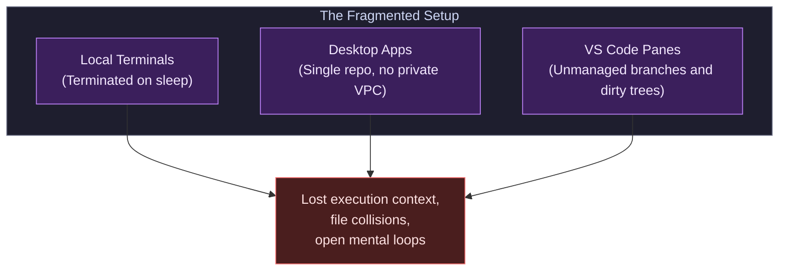
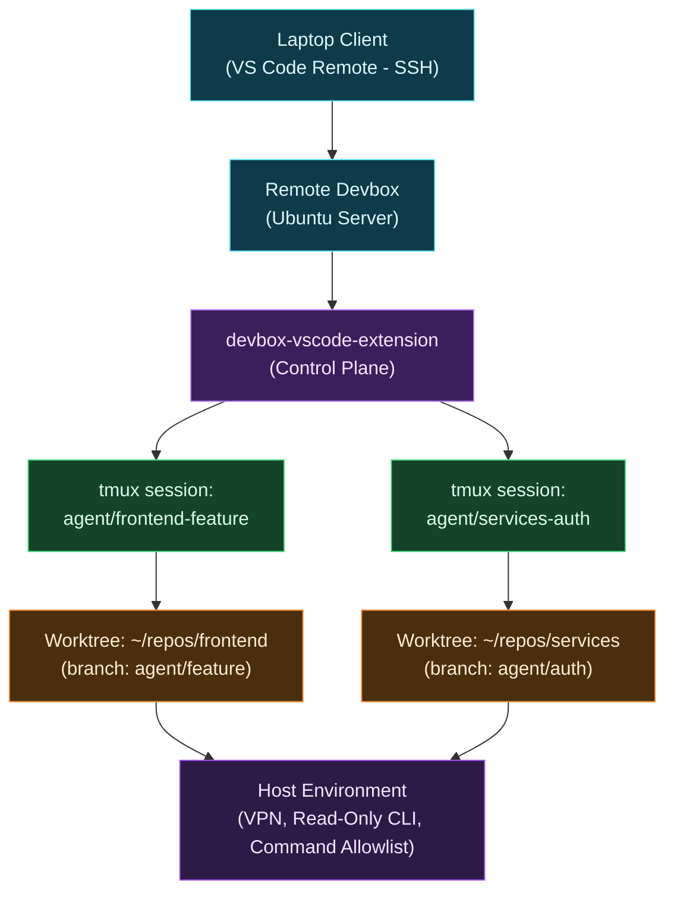

# Managing AI Agents on a Remote Devbox

**TL;DR:** Running autonomous AI coding agents across local terminal tabs and desktop apps drops running tasks whenever your laptop sleeps, and scatters mental focus across unmanaged branches. I moved my agent runtime to a dedicated Linux devbox orchestrated with git worktrees, tmux, and an open-source VS Code extension. This turns VS Code into a persistent control plane, keeps tasks isolated from my working tree, and retains access to private networks and multi-repo test suites.

I'll be honest with you: when I first started running autonomous AI coding agents, I thought my local terminal was all I needed. I opened [Claude Code](https://docs.anthropic.com/en/docs/agents-and-tools/claude-code/overview) in one tab, [OpenAI Codex](https://openai.com/) in another, and kept the desktop app open on a second screen for quick questions. It felt fast at first. But within two weeks, that setup completely fell apart under heavy daily use.

I was losing mental bandwidth trying to remember which terminal tab was refactoring which service. Worse, long-running agent tasks died the moment I shut my laptop lid to step into a meeting. If you run multiple coding agents concurrently, running them locally turns into a constant fight with interrupted sessions and dirty git trees.

## Why Does Running AI Agents Locally Fall Apart?

Running AI coding agents locally starts simple when you run a single prompt. But once you run multiple tasks concurrently, that setup quickly breaks down in three distinct ways.

First, you run into open mental loops. Having four or five concurrent agent sessions scattered across local terminals, integrated editor panes, and desktop apps scatters your focus. You forget which task was running where, only to rediscover abandoned branches days later as open pull requests (PRs). Those unresolved loops linger in your head during evenings and weekends.

Second, local sessions lack durability. The moment you close your laptop, walk into a meeting, or switch between Wi-Fi and ethernet, local terminal connections break. Long-running test suites, dependency builds, or multi-step agent refactors terminate abruptly halfway through execution. You have to inspect the partial state, clean up unstaged changes, and restart the prompt from scratch.

Third, standalone desktop apps hit hard environment boundaries. The [Claude Desktop](https://claude.ai/download) app handles isolated questions well, but it falls short in complex environments. It operates in isolation and cannot manage multi-repo workflows where a front-end monorepo must talk directly to a local services monorepo to run end-to-end integration tests. It also lacks access to private networks. It cannot authenticate against internal Virtual Private Clouds (VPCs) or query [Application Insights](https://learn.microsoft.com/azure/azure-monitor/app/app-insights-overview) logs over a non-production Virtual Private Network (VPN) using a read-only [Azure CLI](https://learn.microsoft.com/cli/azure/) session.

## How Does a Remote Devbox Solve This?

The alternative I moved to is treating my laptop as a thin display and moving the entire agent execution runtime to a dedicated Linux devbox. In my setup, that is an 8-core, 16 GB RAM Ubuntu server running in my home lab, but a cloud virtual machine or an office server works just as well. Instead of running agents directly inside my primary working tree, every agent session runs in its own persistent [tmux](https://github.com/tmux/tmux/wiki) session attached to an isolated [git worktree](https://git-scm.com/docs/git-worktree) (`agent/<task-name>`).

I considered using separate full repository clones or Docker containers for each agent. But full clones waste disk space on duplicate `.git` directories and slow down dependency installs. Docker containers add overhead, slow down file watching, and make running native developer tooling clumsy. Git worktrees share the same underlying repository storage and object history, but check out a completely independent branch into a separate directory. This gives the agent total isolation without duplicating repository data, preventing file-lock collisions and unstaged diff pollution.

This completely changes how I use Visual Studio Code (VS Code). Manual side-by-side programming is gone. VS Code becomes an orchestration dashboard and terminal control plane: one large terminal surface connected to the devbox, a sidebar tracking running sessions and processes, and the file explorer to inspect docs-as-code, [Architecture Decision Records (ADRs)](/nodes/standardizing-api-conventions/), and generated diffs whenever verification is needed.

## How Does the Extension Architecture Work?

To tie this workflow together without switching windows, I built [devbox-vscode-extension](https://github.com/royberris/devbox-vscode-extension) (documented in our [Projects catalog](/projects/devbox-vscode-extension/)). You can install it directly from the [VS Code Marketplace](https://marketplace.visualstudio.com/items?itemName=RoyBerris.devbox-agents) or download the `.vsix` from GitHub releases. It runs directly inside VS Code over [VS Code Remote - SSH](https://code.visualstudio.com/docs/remote/ssh) and acts as the interface layer over tmux, git worktrees, and running agent processes.

### Worktree Isolation and Session Management

The extension eliminates manual git worktree plumbing. Launching an agent provisions a dedicated worktree and spawns a background tmux session tied to that directory.

- **Automated Worktree Lifecycle:** When an agent starts, a new branch is cut and mounted in an isolated worktree path under the repository root. When the work is merged or abandoned, tearing down the session removes the worktree cleanly without leaving stale directories behind.
- **Process Inspection and Cleanup:** The extension queries the host for running Claude Code and Codex process IDs. It identifies whether a process originated from tmux, an interactive SSH session, or became an orphaned daemon, exposing one-click kill controls right in the sidebar.
- **Repository Discovery:** It scans `~/repos` on the devbox, showing ahead and behind commit counts, uncommitted working tree changes, and missing dependencies across every monorepo.

### Reviewing Pull Requests Directly in the Editor

Because the extension relies on native git worktrees rather than proprietary containers, it integrates cleanly with the official [GitHub Pull Requests and Issues extension](https://marketplace.visualstudio.com/items?itemName=GitHub.vscode-pull-request-github). When an agent completes a task and opens a PR, you check out and review the pull request directly inside VS Code over VS Code Remote - SSH on the existing worktree. You never leave the editor to open a browser tab or desktop application just to inspect code changes.

### Host-Level Sandboxing and Guardrails

Running agents on a dedicated Linux host makes sandboxing practical. Instead of granting blanket permissions on your personal workstation, the devbox runs agents with explicit command and network boundaries:

- **Command Allowlisting:** Critical deployment tools, production credentials, and destructive system commands are restricted or blocked entirely.
- **Scoped Network Access:** The devbox maintains a non-production VPN tunnel and a read-only Azure CLI session. Agents can inspect telemetry and logs in [Application Insights](https://learn.microsoft.com/azure/azure-monitor/app/app-insights-overview) to debug issues without having permissions to modify infrastructure or leak sensitive keys.

## What Happened in Practice: Gotchas and Trade-offs

Adopting a remote devbox for agent workflows is not without friction. A few real-world trade-offs stand out from my experience:

- **The Hardware Paradox:** Running agents on a remote 8-core Ubuntu devbox means my powerful local machine (an Apple Silicon M4 Max) sits mostly idle while the devbox compiles code. You trade raw local burst speed for persistence and isolation.
- **Rate Limit Juggling:** Heavy agent usage burns through provider quotas quickly. When hitting Claude rate limits or weekly token caps, the devbox setup lets me pivot the existing worktree session to Codex without losing worktree state or branch progress.
- **Overkill for Casual Use:** If you run one or two simple prompts a day, maintaining a remote server, SSH keys, VPNs, and worktree extensions is unnecessary overhead. This architecture only pays for itself when managing multiple autonomous tasks concurrently across complex repositories.

## Recommendations for You

If you want to move your own agent workflows to a remote machine, start with simple boundaries. Here is what worked best in my setup:

- **Isolate every agent in a dedicated git worktree:** Never let an autonomous agent touch your main working copy. Worktrees isolate file locks, dependencies, and experimental commits.
- **Keep architectural specifications inside the repository:** Store [Architecture Decision Records (ADRs)](/nodes/standardizing-api-conventions/) and specifications directly in the codebase so agents and human reviewers evaluate diffs against the same documented requirements.
- **Run long tasks on persistent remote sessions:** Relying on local terminal sessions guarantees interrupted runs the moment your laptop sleeps or your Wi-Fi drops.
- **Sandbox permissions on a dedicated host:** Setting up a non-root user, firewall rules, and a command allowlist is straightforward on a dedicated Linux host, whereas locking down your primary laptop without breaking your daily tools is nearly impossible.
- **Consolidate sessions into a single control plane:** Keep your terminal, session list, diff review, and pull request workflows anchored inside a single editor window instead of scattering them across multiple apps.

## Conclusion

Moving AI coding agents from my local laptop to a remote Linux devbox solved the two biggest headaches I had: lost execution state and scattered mental focus. With git worktrees for isolation, tmux for session durability, and VS Code Remote - SSH as a control plane, I can kick off three agent refactors, shut my laptop, and come back to review clean pull requests when I'm ready.

Autonomous coding agents are only as good as the environment you give them to run in.

## FAQ

### Why use git worktrees instead of Docker containers or fresh git clones?

Git worktrees share the same underlying repository storage and commit history without downloading gigabytes of duplicate files, while keeping the agent's changes completely isolated from your main working tree. They avoid the file-watching and tooling friction of Docker containers while preventing file-lock collisions.

### What happens to a running agent session if my laptop loses Wi-Fi?

Nothing stops running. Because the agent executes inside a tmux session on the remote devbox, tests keep running and the agent keeps editing code. When you reconnect over VS Code Remote - SSH, you attach right back to the active session.

### How do you sandbox agent permissions on the remote devbox?

The devbox runs agents with command allowlists that block critical deployment commands and destructive system tools. It uses a non-production VPN tunnel and a read-only Azure CLI login, letting agents inspect telemetry in [Application Insights](https://learn.microsoft.com/azure/azure-monitor/app/app-insights-overview) without granting permission to change infrastructure.

### Is a remote devbox setup worth it for casual AI coding?

No. If you only prompt an AI assistant a couple of times a day for small snippets, setting up a remote server, SSH keys, and worktree tooling is unnecessary overhead. It only pays off when you run multiple autonomous tasks concurrently across complex or multi-repo projects.
