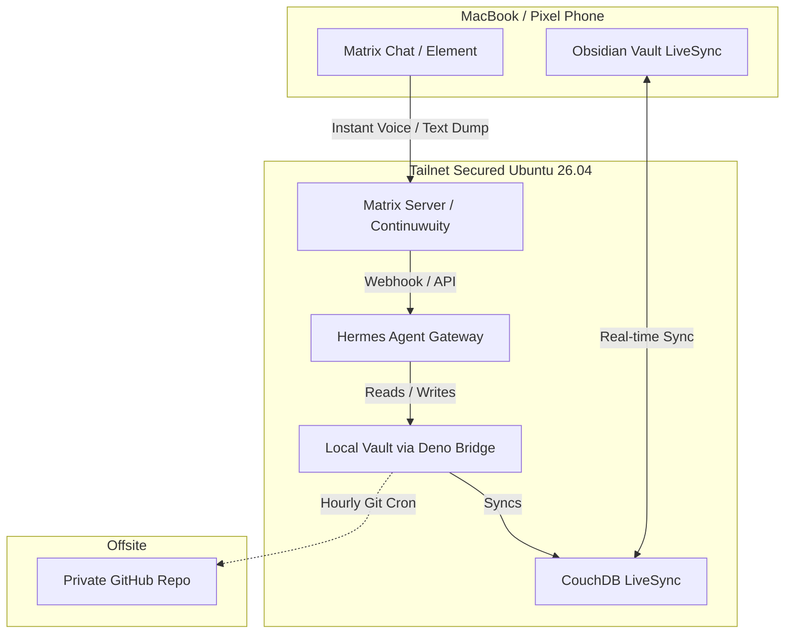

# Mental Cache Invalidation: Self-Hosting a Personal AI Assistant on a $5 VPS to Save Your Weekends

The promise of AI-assisted engineering was supposed to be leisure. Instead, it produced high-bandwidth orchestration. 

When generating code, reviewing architectures, and debugging distributed traces take minutes instead of hours, you stop touching one system at a time. You touch ten. Your brain acts as a state machine holding dangling references to half-baked PRs, edge cases, and architectural ideas long after you shut your laptop. Humans lack atomic garbage collection. Without a trusted, immediate offload mechanism, work follows you into dinner, family time, and sleep.

## The Problem: The Velocity Trap and Cognitive Residue

As software architects and engineers, we operate in an environment where context switching is our highest tax. AI tools multiply our execution velocity, allowing us to spin up multiple workflows, evaluate complex architectural decisions, and draft implementations in a single afternoon. 

However, our cognitive architecture hasn't evolved to flush this state automatically. When you close your laptop at 6 PM, your working memory is still holding open connections to dangling tasks, half-solved bugs, and pending reviews. Without a zero-friction offload sink, your evening becomes an involuntary background process chewing cycles on worries about work.

## The Architecture: A Minimalist, Self-Hosted Sink

Most commercial SaaS assistants require trusting third parties with unfiltered thoughts or introduce too much friction to use on mobile late at night. The solution is an owner-operated stack running on a modest 2 vCPU, 3.8 GB RAM Ubuntu VPS secured entirely behind Tailscale.

### The Stack Components
- **Transport Layer**: A self-hosted Matrix instance (`Continuwuity`) running in Docker on port `6167` (local), providing an end-to-end encrypted chat interface across your phone and laptop.
- **Compute & Agent**: `Hermes Agent` (`hermes-gateway`) running as a `systemd` service, powered by lightweight language models, listening directly to the Matrix chat room.
- **Second Brain Storage**: An Obsidian vault synchronized via `couchdb-livesync` and a local bridge, allowing the AI agent to read and append notes directly to local markdown files.
- **Security & Perimeter**: Zero public exposure—all services bind exclusively to `127.0.0.1` or Tailscale IPs. Inbound traffic is locked down via UFW, SSH key-only access, and unattended security updates.
- **Reliability**: An hourly cron job committing vault state and agent configs (`SOUL.md`, `config.yaml`, cron definitions) to a private GitHub repository.

## The Workflow in Action

1. **The Mobile Dump**: While away from the keyboard, an idea or lingering work anxiety hits. You open your private Matrix client on your phone and fire off a quick text or voice note.
2. **Asynchronous Capture**: The `Hermes` gateway receives the message, processes the context using the configured LLM, and appends the structured thought directly into your Obsidian vault's daily note or inbox.
3. **The Psychological Payoff**: The loop closes instantly. Because your second brain caught the reference, your mind's cache is invalidated. You can finally let go.

> [!NOTE]
> The secret to offloading is **zero friction**. If capturing a thought requires opening a heavy app or navigating a complex UI, you will procrastinate. Direct-to-chat messaging piped into your markdown vault eliminates that barrier entirely.

## Production Rules of Thumb

- **Isolate Your Perimeter**: Never expose databases or agents to the public internet. Bind everything to loopback and use a private mesh network like Tailscale.
- **Automate State Backups**: Code and notes are valuable state. An hourly cron job pushing private git commits safeguards your second brain against infrastructure failure.
- **Separate Intake from Execution**: Use chat for fast raw capture; let your background agent categorize and file. Save deep parsing and execution for working hours.

## Conclusion

Self-hosting a personal AI assistant isn't about chasing infrastructure complexity; it's about reclaiming your mental bandwidth. By building an isolated, private sink for your thoughts, you bridge the gap between high-velocity engineering and personal peace of mind.

---

*Written by Roy Berris. Maintained in a self-hosted Obsidian vault.*
