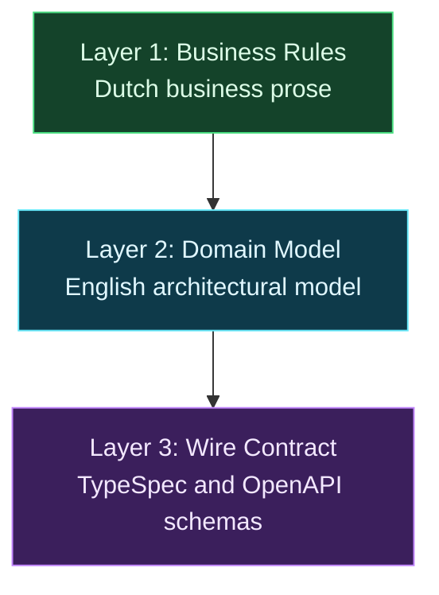

# The Three-Layer System for Consistent AI Specifications

**TL;DR:** I split API specification generation into three strictly one-way derived layers: native business rules, an English domain model, and a wire contract. This compiler-like pipeline gives the model one job at a time, stopping hallucinations and schema drift before anything reaches code. Upstream artifacts remain the sole source of truth, and nobody hand-edits the compiled schemas.

When I first asked an AI model to generate a complete API specification directly from rough requirements, the result looked convincing on the surface. But when I inspected the endpoints, the flaws jumped out. The model hallucinated default values, dropped critical validation rules, and invented transport semantics that made no sense for my architecture. Trying to fix all of that by stuffing more rules into one massive prompt just confused the model and made the output drift even further.

Today's language models struggle to balance business rules, domain logic, and HTTP serialization details at the same time. If you ask a model to jump straight from unstructured notes to a finished [OpenAPI](https://spec.openapis.org/oas/latest.html) document, it has to bridge ambiguous human intent with rigid serialization rules in one shot. That is asking too much of current models. To solve this, my team treats specification generation like a compiler chain: three distinct, strictly one-way layers that separate business rules, domain models, and wire contracts.

## Why Does Single-Shot API Generation Lead to Schema Drift?

Most teams start by feeding user stories or business notes into a chat prompt and asking for an OpenAPI document or code stubs immediately. Under the surface, the model tries to solve three completely different problems at the same time: understanding business policies, modeling domain relationships, and formatting HTTP serialization details. In that single pass, it silently invents enum values, misinterprets domain invariants, and overlooks edge cases just to produce syntactically valid JSON or YAML.

This creates silent drift between what business stakeholders expect and what engineers actually deploy. The trouble usually shows up late, often when validation fails in staging. When that happens, the temptation is to patch the generated schema by hand. But that manual fix introduces a mismatch between your documentation, your prompts, and your codebase. The next time someone runs an AI generation tool, it overwrites those manual fixes or diverges even further because the upstream prompt was never corrected.

Splitting this workflow into sequential passes introduces a real latency trade-off. Generating intermediate representations takes several minutes instead of several seconds. In my experience, that extra execution time pays for itself immediately. You keep the context clean at each step and save yourself painful debugging marathons later.

## How Does the Three-Layer Compiler Pipeline Work?

Instead of treating specification generation as a single prompt, I treat it like a compiler chain. Each stage has a single, clear job, moving strictly from business intent down to machine contracts. Upstream artifacts remain the single source of truth, and downstream layers are generated automatically.

The system organizes requirements into three distinct stages:

- **Layer 1 (Business Rules):** Written in native Dutch business prose to capture stakeholder rules directly. In my projects in the Netherlands, capturing policies in the stakeholders' native language prevents premature translation errors and preserves regulatory nuances that non-technical domain experts care about.
- **Layer 2 (Domain Model):** Expressed as an English architectural specification. This layer normalizes Dutch domain concepts into formal entities, [value objects](/nodes/using-value-objects-in-net/), lifecycle states, and domain invariants without any HTTP or serialization baggage.
- **Layer 3 (Wire Contract):** Defined in [TypeSpec](https://typespec.io/) or raw OpenAPI schemas. This layer handles transport mechanics, status codes, query parameters, header definitions, and JSON payload serialization, following the principles I described in [Designing APIs for AI Agents](/nodes/designing-apis-for-ai-agents/).

This workflow is an automated compiler pipeline rather than a traditional waterfall process. My team edits the upstream business rules, runs the generation tool, and lets the pipeline compile the downstream contracts. Nobody edits the compiled wire contract by hand.

## Why Is This Three-Layer Scaffolding Temporary?

I want to be clear about why this system exists today. These three separate stages are practical scaffolding built around the limits of current language models. Right now, models cannot reliably preserve nuance across multiple levels of abstraction in a single inference pass.

I think of this three-layer pipeline as a deliberate engineering hedge. It stabilizes current model outputs today without locking our architecture into rigid, permanent workflow machinery. I documented this architectural boundary choice in an [Architecture Decision Record (ADR)](https://adr.github.io/) so the team understands why we enforce these boundaries and under what conditions we can simplify them.

Eventually, models will be capable enough to jump from business discussions to validated wire schemas without intermediate steps. When that shift happens, explicit file-based handoffs between layers will disappear from our daily work. Even then, the underlying separation of concerns between business policy, domain modeling, and transport protocols will remain structurally sound.

## How Does the Pipeline Stay Consistent When Models Change?

Model behavior changes with every new release, but this pipeline keeps our contracts stable. Layer 1 functions as source code, while Layer 2 and Layer 3 act as compiled build artifacts. When business requirements shift, I update the business rules in Layer 1 and trigger a clean compilation rather than patching downstream files.

My team stores domain rules, conventions, and architectural constraints inside version-controlled repository instructions and skills. Keeping guidance in git repositories ensures every engineer and continuous integration agent runs the exact same prompts. Ad-hoc chat sessions lose context quickly, but versioned skills keep that knowledge in the repository where everyone can use it.

The architecture remains completely tool-agnostic. You can switch the underlying foundation model or migrate from TypeSpec to another interface definition language (IDL) whenever you choose. Because your core domain definitions live upstream in clean domain models, changing a code generator never forces a rewrite of your business rules.

## Recommendations for Your Team

Setting up this pipeline requires some discipline around layer boundaries and prompt management. If you want to set up this system in your own projects, here is the practical advice I give:

- **Treat Layer 1 as the sole source of truth:** Update business rules in your native prose before regenerating downstream domain models and wire contracts.
- **Automate downstream compilation:** Run models in strict one-way passes using automated scripts or continuous integration tasks.
- **Version control your prompt instructions:** Commit architectural rules, ADRs, and skills to your git repository alongside the project code.
- **Validate contracts with deterministic linters:** Use standard TypeSpec and OpenAPI compilers or linters to catch syntax errors and schema flaws immediately.
- **Never edit generated layers by hand:** If you hand-tweak Layer 2 or Layer 3 outputs, subsequent regenerations will wipe out your modifications.
- **Avoid two-way sync:** Never attempt to back-propagate changes from a wire contract back into the domain model. Keep it strictly one-way.
- **Keep transport details out of business rules:** HTTP headers, status codes, and serialization quirks do not belong in Layer 1 or Layer 2.
- **Do not rely on ad-hoc chat windows:** Run contract generations through versioned scripts and repository tooling, never in ad-hoc browser chats.

## Conclusion

Generating API specifications with AI only works reliably when you respect the limits of current models. By treating specification generation as a one-way compiler pipeline across three distinct layers, you eliminate hallucinated fields and prevent schema drift before anything touches your codebase.

You get reliable, linted wire contracts today, and your domain logic stays clean for whatever tools you use tomorrow. Stop asking one prompt to do three jobs at once.

## FAQ

### Why write Layer 1 in Dutch instead of English?

Writing Layer 1 in native Dutch prose captures business rules directly from stakeholders without premature translation. In my projects in the Netherlands, this preserves regulatory nuances and policy details that domain experts care about, before Layer 2 translates and normalizes them into English domain concepts.

### Why not generate the OpenAPI specification in a single prompt?

Current AI models struggle to balance business nuance, domain invariants, and HTTP serialization details simultaneously. A single-shot prompt frequently hallucinates default values, drops validation rules, and invents transport semantics, leading to schema drift between stakeholder expectations and deployed code.

### What happens when business requirements change?

You update the business rules in Layer 1 and recompile downstream layers through the automated pipeline. Because Layer 2 and Layer 3 are treated as compiled build artifacts, you never hand-patch generated schemas, which prevents prompts and code from diverging.

### Will you always need explicit three-layer handoffs?

No. The three-layer pipeline is scaffolding designed around the reasoning limits of current language models. As future models gain the capacity to handle multi-step reasoning in a single pass, explicit file-based handoffs will disappear, though the conceptual separation between business rules, domain modeling, and wire protocols will remain sound.

---

*This blog post was created using the AI-assisted approach described in [AI-Assisted Blogging](/nodes/ai-assisted-blogging/). All technical insights, architecture decisions and recommendations reflect my direct experience as a software architect, while AI helped refine the structure and readability.*
