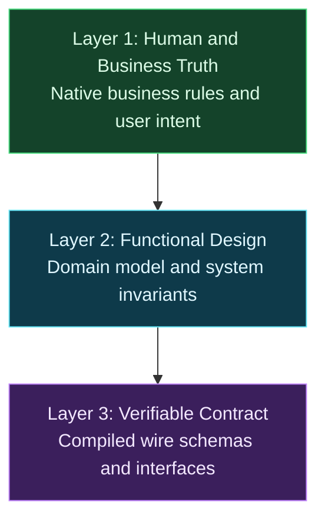

# The Three-Layer System for Consistent AI Specifications

**TL;DR:** I treat the specification as the single source of truth for user intent and business rules, compiling functional design down through three strict layers. Business rules stay in native prose, the domain model structures invariants in English, and the contract or wire schema is simply the final compiled layer. Splitting the process this way stops hallucinations and eliminates schema drift.

When I first asked an AI model to generate a functional specification directly from rough requirements, the result looked convincing on the surface. But when I inspected the logic, the problems jumped out. The model quietly dropped business validation rules, invented defaults out of thin air, and hallucinated system behavior. Trying to fix all of that by stuffing more instructions into one giant prompt just confused the model and made the output drift even further.

People often assume specification generation is just about producing API definitions or code stubs. In my projects, I look at it differently. A specification is the functional design of your system, and it is the single source of truth for user intent and business rules. Today's language models cannot bridge human intent and rigid technical contracts in one jump. To solve this, my team treats functional design like a compiler chain: three distinct, strictly one-way layers that compile human truth down into a verifiable contract.

## Why Does Single-Shot Specification Lead to Drift?

Most teams start by feeding user stories or meeting notes into a chat prompt and asking for an interface definition or code stubs immediately. Under the surface, the model tries to solve three completely different problems at the same time: understanding business policies, modeling domain relationships, and formatting technical contract syntax. In that single pass, it silently invents enum values, misinterprets domain invariants, and overlooks edge cases just to produce syntactically valid output.

This creates silent drift between what business stakeholders expect and what engineers actually build. The trouble usually shows up late, often when validation fails in staging. When that happens, the temptation is to patch the generated schema or contract by hand. But the contract is only the final compiled artifact of your functional design. Hand-editing downstream contracts breaks the chain of truth. The next time you run an AI generation tool, it overwrites those manual fixes or diverges further because the source of truth was never updated.

Splitting this workflow into sequential passes introduces a small latency trade-off. Generating intermediate representations takes a few minutes instead of a few seconds. In my experience, that extra time is worth it. You keep the context clean at each step and save yourself painful debugging sessions later.

## How Does the Three-Layer Compiler Pipeline Work?

Instead of treating specification generation as a single prompt, I treat it like a compiler chain. Each stage has a single, clear job, moving strictly from human and business intent down to machine contracts. Upstream artifacts remain the single source of truth, and downstream layers are generated automatically.

The system organizes requirements into three distinct stages:

- **Layer 1 (Human and Business Truth):** Written in native business prose to capture stakeholder rules directly. In my projects in the Netherlands, capturing policies in Dutch prevents premature translation errors and preserves regulatory nuances that non-technical domain experts care about. Stakeholders can read, verify, and own this layer directly.
- **Layer 2 (Functional Design and Domain Model):** Expressed as an English architectural specification. This layer normalizes Dutch business concepts into formal entities, [value objects](/nodes/using-value-objects-in-net/), lifecycle states, and domain invariants without any transport or serialization baggage. It defines what the system does and why, independent of delivery protocols.
- **Layer 3 (Verifiable Contract):** Defined in [TypeSpec](https://typespec.io/), OpenAPI, or schema definitions. This layer handles transport mechanics, status codes, query parameters, header definitions, and serialization, following the principles I described in [Designing APIs for AI Agents](/nodes/designing-apis-for-ai-agents/). Wire contracts and API schemas are not the starting point. They are the final compiled layer of functional design.

This workflow is an automated compiler pipeline rather than a traditional waterfall process. My team edits the upstream business rules, runs the generation tool, and lets the pipeline compile the downstream contracts. Nobody edits the compiled wire contract by hand.

## Why Is This Three-Layer Scaffolding Temporary?

I want to be clear about why this system exists today. These three separate stages are practical scaffolding built around the limits of current language models. Right now, models cannot reliably preserve nuance across multiple levels of abstraction in a single inference pass.

I think of this three-layer pipeline as a deliberate engineering hedge. It stabilizes model outputs today without locking our architecture into rigid, permanent workflow machinery. I documented this architectural boundary choice in an [Architecture Decision Record (ADR)](https://adr.github.io/) so the team understands why we enforce these boundaries and under what conditions we can simplify them.

Eventually, models will be capable enough to jump from business discussions to validated wire schemas without intermediate steps. When that shift happens, explicit file-based handoffs between layers will disappear from our daily work. Even then, the underlying separation of concerns between business truth, functional design, and verifiable contracts will remain structurally sound.

## How Does the Pipeline Stay Consistent When Models Change?

Model behavior changes with every new release, but this pipeline keeps our specifications stable. Layer 1 functions as source code, while Layer 2 and Layer 3 act as compiled build artifacts. When business requirements shift, I update the business rules in Layer 1 and trigger a clean compilation rather than patching downstream files.

My team stores domain rules, conventions, and architectural constraints inside version-controlled repository instructions and skills. Keeping guidance in git repositories ensures every engineer and continuous integration agent runs the exact same prompts. Ad-hoc chat sessions lose context quickly, but versioned skills keep that knowledge in the repository where everyone can use it.

The architecture remains completely tool-agnostic. You can switch the underlying foundation model or migrate from TypeSpec to another interface definition language whenever you choose. Because your core functional design lives upstream in clean domain models, changing a code generator never forces a rewrite of your business rules.

## Recommendations for Your Team

Setting up this pipeline requires some discipline around layer boundaries and prompt management. If you want to set up this system in your own projects, here is the practical advice I give:

- **Treat Layer 1 as the sole source of truth:** Update business rules in your native prose before regenerating downstream domain models and wire contracts.
- **View the wire contract as the compiled layer:** Treat APIs and schemas as the final compiled representation of functional design, not the functional design itself.
- **Automate downstream compilation:** Run models in strict one-way passes using automated scripts or continuous integration tasks.
- **Version control your prompt instructions:** Commit architectural rules, ADRs, and skills to your git repository alongside the project code.
- **Validate contracts with deterministic tools:** Use standard TypeSpec compilers or schema linters to catch syntax errors and contract flaws immediately.
- **Never edit generated layers by hand:** If you hand-tweak Layer 2 or Layer 3 outputs, subsequent compilations will wipe out your modifications.
- **Avoid two-way sync:** Never attempt to back-propagate changes from a wire contract back into the domain model. Keep it strictly one-way.
- **Keep transport details out of business rules:** Serialization quirks, status codes, and HTTP headers do not belong in Layer 1 or Layer 2.

## Conclusion

A specification is not just an API contract. It is the functional design that captures user intent and business rules as your single source of truth. By treating functional design as a three-layer compiler pipeline, you stop hallucinations and keep your contracts consistent with what the business actually needs.

Give the model one job at a time, and let the compiler do the rest.

## FAQ

### Is this three-layer system only for APIs?

No. While the final layer often produces API schemas or interface definitions, the pipeline is about generating the functional design as a whole. The specification is the single source of truth for user intent and business rules, and the contract is simply the final compiled layer of that functional design.

### Why write Layer 1 in Dutch instead of English?

Writing Layer 1 in native Dutch prose captures business rules directly from stakeholders without premature translation. In my projects in the Netherlands, this preserves regulatory nuances and policy details that domain experts care about, before Layer 2 translates and normalizes them into English domain concepts.

### Why not generate the entire specification in a single prompt?

Current AI models struggle to balance human intent, domain invariants, and rigid contract syntax at the same time. Asking for everything in one prompt leads to hallucinated fields, dropped validation rules, and schema drift between business expectations and technical output.

### What happens when business requirements change?

You update the business rules in Layer 1 and recompile downstream layers through the automated pipeline. Because Layer 2 and Layer 3 are compiled build artifacts, you never hand-patch downstream files, which keeps your prompts, functional design, and contracts completely in sync.

---

*This blog post was created using the AI-assisted approach described in [AI-Assisted Blogging](/nodes/ai-assisted-blogging/). All technical insights, architecture decisions and recommendations reflect my direct experience as a software architect, while AI helped refine the structure and readability.*
