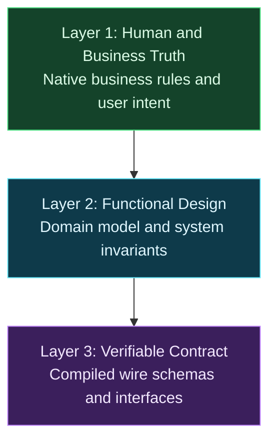

# The Three-Layer System for Consistent AI Specifications

**TL;DR:** We treat the specification as the single source of truth for user intent and business rules, compiling functional design down through three strict layers. Business rules stay in native prose, the domain model structures invariants in English, and the contract or wire schema is simply the final compiled layer. Splitting the process this way stops hallucinations and eliminates schema drift.

When we first asked an AI model to generate a functional specification directly from rough requirements, the result looked convincing on the surface. But when we inspected the logic, the problems jumped out. The model quietly dropped business validation rules, invented defaults out of thin air, and hallucinated system behavior. Trying to fix all of that by stuffing more instructions into one giant prompt just confused the model and made the output drift even further.

People often assume specification generation is just about producing API definitions or code stubs. At New Orange, we look at it differently. A specification is the functional design of your system, and it is the single source of truth for user intent and business rules. Today's language models cannot bridge human intent and rigid technical contracts in one jump. To solve this, we treat functional design like a compiler chain: three distinct, strictly one-way layers that compile human truth down into a verifiable contract.

## Why Does Single-Shot Specification Lead to Drift?

Most teams start by feeding user stories or meeting notes into a chat prompt and asking for an interface definition or code stubs immediately. Under the surface, the model tries to solve three completely different problems at the same time: understanding business policies, modeling domain relationships, and formatting technical contract syntax. In that single pass, it silently invents enum values, misinterprets domain invariants, and overlooks edge cases just to produce syntactically valid output.

This creates silent drift between what business stakeholders expect and what engineers actually build. The trouble usually shows up late, often when validation fails in staging. When that happens, the temptation is to patch the generated schema or contract by hand.

But the contract is only the final compiled artifact of your functional design. Hand-editing downstream contracts breaks the chain of truth. The next time you run an AI generation tool, it overwrites those manual fixes or diverges further because the source of truth was never updated.

Splitting this workflow into sequential passes introduces a small latency trade-off. Generating intermediate representations takes a few minutes instead of a few seconds. In our experience, that extra time is worth it. You keep the context clean at each step and save yourself painful debugging sessions later.

## How Does the Three-Layer Compiler Pipeline Work?

Instead of treating specification generation as a single prompt, we treat it like a compiler chain. Each stage has a single, clear job, moving strictly from human and business intent down to machine contracts. Upstream artifacts remain the single source of truth, and downstream layers are generated automatically.



The system organizes requirements into three distinct stages:

- **Layer 1 (Human and Business Truth):** Written in native business prose to capture stakeholder rules directly. In our projects at New Orange in the Netherlands, capturing policies in Dutch prevents premature translation errors and preserves regulatory nuances that non-technical domain experts care about. Stakeholders can read, verify, and own this layer directly.
- **Layer 2 (Functional Design and Domain Model):** Expressed as an English architectural specification following [Domain-Driven Design](https://www.domainlanguage.com/ddd/) principles. This layer normalizes business concepts into formal entities, [value objects](/nodes/using-value-objects-in-net/), lifecycle states, and domain invariants without any transport or serialization baggage. It defines what the system does and why, independent of delivery protocols.
- **Layer 3 (Verifiable Contract):** Defined in [TypeSpec](https://typespec.io/), OpenAPI, or schema definitions. This layer handles transport mechanics, status codes, query parameters, header definitions, and serialization, following the principles we described in [Designing APIs for AI Agents](/nodes/designing-apis-for-ai-agents/). Wire contracts and API schemas are not the starting point. They are the final compiled layer of functional design.

This workflow is an automated compiler pipeline rather than a traditional waterfall process. We edit the upstream business rules, run the generation tool, and let the pipeline compile the downstream contracts. Nobody edits the compiled wire contract by hand.

## How Do We Capture and Validate Business Rules?

You cannot expect an AI model or an engineer sitting alone to invent business truth. Layer 1 requires collaborative discovery with domain experts before any code or prompt runs. In our projects at New Orange, we use three discovery techniques to draw out rules from stakeholders:

- **[Event Storming](https://www.eventstorming.com/):** We gather domain experts and developers in a room to map domain events along a business timeline. We explore what happens across a process, what triggers each action, and which policies govern state changes.
- **[Example Mapping](https://cucumber.io/blog/bdd/example-mapping-introduction/):** We take each user story and break it down into concrete business rules illustrated by realistic examples. Talking through concrete scenarios reveals edge cases and hidden assumptions that abstract bullet points conceal.
- **Stakeholder interviews:** We talk directly with product managers, operational staff, and compliance officers. Capturing their exact words in their native language preserves legal and operational nuances that get lost when developers translate requirements straight into technical jargon.

Capturing fragments of rules is only half the battle. You also need to validate the requirements as a coherent whole before feeding them to an AI compiler.

We run validation sessions with the business to check completeness. We walk through the end-to-end user journey to make sure every failure mode, boundary condition, and lifecycle transition has an explicit rule. Walking through realistic examples surfaces edge cases early, when changing a rule costs nothing.

Once the rules are complete and unambiguous, we secure formal sign-off from business stakeholders. Because Layer 1 uses plain language without HTTP status codes, JSON fields, or database tables, non-technical experts can read every sentence and take full ownership. This sign-off freezes the baseline for Layer 1. Only after the business approves Layer 1 does the AI compiler pipeline turn those rules into downstream models and contracts.

## Tracing an Example Through the Three Layers: A Library Book Loan

To see how this works in practice, consider a classic scenario: a member borrowing a physical book from a library. Walking this feature through the three layers shows how business intent compiles into a technical contract while maintaining complete traceability.

### Layer 1: Business Rules

Layer 1 captures the intent and rules in plain language approved by the library staff:

- **User Intent:** A registered library member wants to borrow a physical book.
- **Rule 1 (Loan limit):** A member can have at most 5 active book loans at any time.
- **Rule 2 (Good standing):** A member cannot borrow books if they have an unpaid fine.
- **Rule 3 (Loan period):** The standard loan period is 21 days from the date of checkout.

There are no endpoints, status codes, or database keys here. Any librarian can read this list and confirm whether it accurately describes how the library operates.

### Layer 2: Domain Model

Next, the compiler pipeline generates the English architectural specification. Layer 2 applies domain-driven design concepts to model entities, invariants, post-conditions, and domain events:

- **Entity:** `Loan` (attributes: `loanId`, `memberId`, `bookId`, `loanDate`, `dueDate`, `status`).
- **Domain Invariant (`BorrowBookPolicy`):** A loan can only be created if the member's current active loans count is less than 5, and the member's unpaid fine balance is zero.
- **Post-conditions:** A new `Loan` is instantiated with `status: Active` and `dueDate` calculated as `loanDate + 21 days`.
- **Domain Event:** The system emits a `BookBorrowed` event containing `loanId`, `memberId`, `bookId`, and `dueDate`.

Layer 2 defines what the domain logic must enforce. It still contains zero HTTP headers or serialization details.

### Layer 3: Verifiable Contract

Finally, the pipeline compiles Layer 2 into a verifiable API contract. Here is the OpenAPI definition for the borrow operation:

```yaml
paths:
  /members/{memberId}/loans:
    post:
      summary: Borrow a book
      operationId: borrowBook
      security:
        - bearerAuth: ["loans:borrow"]
      parameters:
        - name: memberId
          in: path
          required: true
          schema:
            type: string
      requestBody:
        required: true
        content:
          application/json:
            schema:
              type: object
              required:
                - bookId
              properties:
                bookId:
                  type: string
      responses:
        "201":
          description: Book borrowed successfully
          content:
            application/json:
              schema:
                $ref: "#/components/schemas/Loan"
        "409":
          description: Business policy violation
          content:
            application/json:
              schema:
                type: object
                required:
                  - error
                properties:
                  error:
                    type: string
                    enum:
                      - loan-limit-reached
                      - unpaid-fine
```

Notice how this contract structures the response codes. The schema returns a 201 status code with the created loan on success, or a 409 Conflict with a machine-readable error when a domain rule fails.

### Emphasizing Traceability

Look closely at how every line in this Layer 3 contract traces directly back through Layer 2 to Layer 1:

- The path `/members/{memberId}/loans` and operation summary `Borrow a book` trace directly to the plain-language user intent in Layer 1.
- The required permission `loans:borrow` traces to the library policy that the caller must have borrowing privileges.
- The `409` error enum `loan-limit-reached` traces through the Layer 2 `BorrowBookPolicy` invariant back to Rule 1 (limit of 5 active loans).
- The `409` error enum `unpaid-fine` traces through the Layer 2 invariant back to Rule 2 (no unpaid fines allowed).
- The `dueDate` in the returned `Loan` object traces through the Layer 2 post-condition back to Rule 3 (21-day loan duration).

Nothing in the contract appears out of thin air. If a model generates an unexpected error code or an extraneous query parameter, you can flag it instantly because it lacks an upstream parent in Layer 1. Every line in the contract traces directly back to an approved business rule.

## Why Is This Three-Layer Scaffolding Temporary?

We want to be clear about why this system exists today. These three separate stages are practical scaffolding built around the limits of current language models. Right now, models cannot reliably preserve nuance across multiple levels of abstraction in a single inference pass.

We think of this three-layer pipeline as a deliberate engineering hedge. It stabilizes model outputs today without locking our architecture into rigid, permanent workflow machinery. We documented this architectural boundary choice in an [Architecture Decision Record (ADR)](https://adr.github.io/) so our team understands why we enforce these boundaries and under what conditions we can simplify them.

Eventually, models will be capable enough to jump from business discussions to validated wire schemas without intermediate steps. When that shift happens, explicit file-based handoffs between layers will disappear from our daily work. Even then, the underlying separation of concerns between business truth, functional design, and verifiable contracts will remain structurally sound.

## How Does the Pipeline Stay Consistent When Models Change?

Model behavior changes with every new release, but this pipeline keeps our specifications stable. Layer 1 functions as source code, while Layer 2 and Layer 3 act as compiled build artifacts. When business requirements shift, we update the business rules in Layer 1 and trigger a clean compilation rather than patching downstream files.

At New Orange, we store domain rules, conventions, and architectural constraints inside version-controlled repository instructions and skills. Keeping guidance in git repositories ensures every engineer and continuous integration agent runs the exact same prompts. Ad-hoc chat sessions lose context quickly, but versioned skills keep that knowledge in the repository where everyone can use it.

The architecture remains completely tool-agnostic. You can switch the underlying foundation model or migrate from TypeSpec to another interface definition language whenever you choose. Because your core functional design lives upstream in clean domain models, changing a code generator never forces a rewrite of your business rules. When tools improve, downstream layers are simply regenerated.

## Recommendations for Your Team

Setting up this pipeline requires discipline around layer boundaries and prompt management. If you want to set up this system in your own projects, here is our practical advice:

- **Adopt a spec-first mindset:** Treat functional design as the single source of truth for user intent and business rules, not code stubs or handwritten schemas.
- **Treat Layer 1 as the sole source of truth:** Update business rules in native prose and secure business sign-off before compiling downstream layers.
- **Ensure strict traceability:** Make sure every property, operation, and error status in Layer 3 is derived from and traceable to an approved Layer 1 rule.
- **View the wire contract as the compiled layer:** Treat APIs and schemas as the final compiled representation of functional design, not the starting point.
- **Ground Layer 2 in domain-driven design:** Express domain invariants, entities, and events in clean English before worrying about transport protocols.
- **Regenerate downstream layers when tools improve:** Treat Layer 2 and Layer 3 as build artifacts. When you upgrade models or linters, recompile from Layer 1 instead of hand-patching files.
- **Automate downstream compilation:** Run models in strict one-way passes using automated scripts or continuous integration tasks.
- **Version control your prompt instructions:** Commit architectural rules, ADRs, and skills to your git repository alongside the project code.
- **Validate contracts with deterministic tools:** Use standard TypeSpec compilers or schema linters to catch syntax errors and contract flaws immediately.
- **Never edit generated layers by hand:** If you hand-tweak Layer 2 or Layer 3 outputs, subsequent compilations will wipe out your modifications.
- **Avoid two-way sync:** Never attempt to back-propagate changes from a wire contract back into the domain model. Keep it strictly one-way.
- **Keep transport details out of business rules:** Serialization quirks, status codes, and HTTP headers do not belong in Layer 1 or Layer 2.

## Conclusion

A specification is not just an API contract. It is the functional design that captures user intent and business rules as your single source of truth. By treating functional design as a three-layer compiler pipeline, you stop hallucinations and keep your contracts consistent with what the business actually needs.

Give the model one job at a time, and let the compiler do the rest.

## FAQ

### Is this three-layer system only for APIs?

No. While the final layer often produces API schemas or interface definitions, the pipeline is about generating the functional design as a whole. The specification is the single source of truth for user intent and business rules, and the contract is simply the final compiled layer of that functional design.

### How do you capture business rules before compiling?

We capture business rules through collaborative workshops with domain experts, using Event Storming to discover events, Example Mapping to pin down rules and edge cases, and stakeholder interviews. We validate the rules as a coherent whole and secure formal business sign-off before running the AI compiler pipeline.

### Why write Layer 1 in native language instead of English?

Writing Layer 1 in native business prose, such as Dutch in our projects at New Orange in the Netherlands, captures policies directly from stakeholders without premature translation. This preserves regulatory nuances and policy details that domain experts care about, before Layer 2 translates and normalizes them into English domain concepts.

### What happens when business requirements change or tools improve?

You update the approved business rules in Layer 1 and recompile downstream layers through the automated pipeline. Because Layer 2 and Layer 3 are compiled build artifacts, you never hand-patch downstream files, and you can regenerate your entire contract whenever your foundation models or toolchain improve.

---

*This blog post was created using the AI-assisted approach described in [AI-Assisted Blogging](/nodes/ai-assisted-blogging/). All technical insights, architecture decisions and recommendations reflect our direct experience as software architects, while AI helped refine the structure and readability.*
